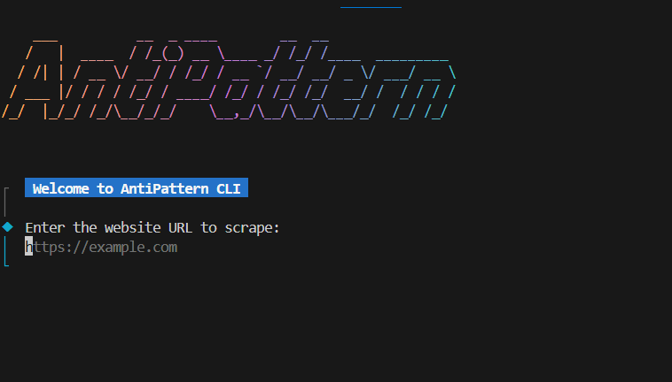
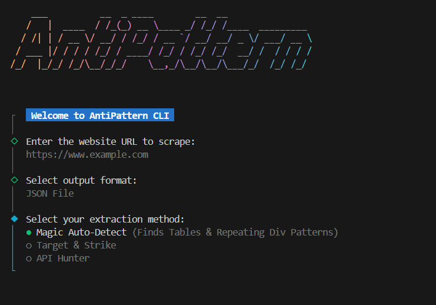

# Antipattern
**AntiPattern** is a **Node.js** webscraping cli tool that will save your time while gathering data from website for your project.

## Dependencies
- Node.js 20 or higher
- Additional download size 635MB
> **Note : Additional Download** are chromium , and some headless browser operation tools.The cli will request to download.Download will be started with this command in programmtically `npx playwright install chromium`.


## Features & goal of this project
All these data can be saved into csv and json format.

**Magic Auto Detect** mode,this scrap baked data from html page by fetching the input url just like a human.The problem is most of the modren websites use only div in almost everywhere(called div soup in React ,vue or any js based) instead of table tag or some meaningful semantic tags.

>The **AntiPattern** is smart enough to detect html tag that look like a list of elements (scroll list or grib or some repeated strucutre)

**Target & Strike** mode,this is the manual mode that will chase the target html element by CSS selector ( css id , class ,tag etc).you can either **only view the data or simulate the intreact with that selected html tag**.
Example if you select this :
```html
<button id="click-btn">View All</button>
```
you can view the text of that button or let the tool interact with this button if you want.
> **Warning⚠️** : you have to check the button is not a download button or some heavy job becaue this tool will only give you json data or scraped from html.This tool cannot download any files.

**API Hunter** mode,this mode can show you exposed api url and you can either read only the url string or shoot api request and get the data from it.This will save your time from watching dev tool.

## Running the cli
If you want to have full aesthetic art run with the VsCode terminal or a shell that can handle utf-8.

To run the cli you have to run at root folder of this project
```shell
npm install
``` 
**In VsCode**
Run this
```shell
node src/index.js
```
**In cmd or other system shell**
you can run this :
```shell
npm run dev
```
## Demo





